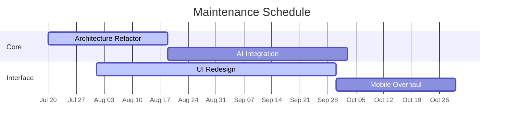

<div align="center">

<!-- Hero Header with Gradient Background -->


<!-- Typing Banner -->
<p align="center">
  
</p>

> general hosting by Elon MD WhatsApp bot multi device ✓

  
**Status**: `Active Maintenance`  
**Estimated Completion**: 2025-11-20  
**Progress**: 
```diff
+ Completed [██████████░░░░░░░░░░░░] 40%
- Pending  [░░░░░░░░░░░░░░░░░░░░░░] 60%
```

##  Timeline



---

<div align="center">

**The Most Advanced Multi-Purpose WhatsApp Bot with 150+ Premium Features**

[🚀 Deploy to Render](https://render.com) • [☁️ Deploy to Koyeb](https://koyeb.com) • [🔵 Deploy to Heroku](https://heroku.com) 

</div>

## 🔥 Get Session ID

<p align="center">
  <a href="https://elon-pair.onrender.com" target="_blank">
    
  </a>
</p>

### 🚀 Quick Deploy

Deploy Elon MD to your favorite platform with one click:

### ☁️ **Cloud Platforms**

| Platform | Deploy Link | Free Tier | Performance |
|----------|-------------|-----------|-------------|
| **Render** | [](https://github.com/elondrex/Elon-MD) | ✅ 500 hours/month | ⭐⭐⭐⭐ |
| **Koyeb** | [](https://github.com/elondrex/Elon-MD) | ✅ Always free | ⭐⭐⭐⭐⭐ |
| **Heroku** | [](https://github.com/elondrex/Elon-MD) | ⚠️ Limited free | ⭐⭐⭐ |

### 🖥️ **𝗙𝗿𝗲𝗲 Options**

| Platform | Tutorial Link | Difficulty | Best For |
|----------|---------------|-----------|----------|
| **RENDER** | [📱 Termux Guide](coming soon) | ⭐⭐⭐ | Mobile hosting |

##  **[Elon MD star dev Features message via ad]**

<table>
<tr>
<td width="50%">

### 🤖 **AI-Powered**
- 🧠 **Multiple AI Providers** - OpenAI & Anthropic support
- 💬 **Context-Aware** - Remembers conversation history
- 🎯 **Smart Responses** - Natural, human-like interactions
- 🌍 **Multi-Language** - Responds in user's language

</td>
<td width="50%">


### **[WhatsApp Integration]**
- 🔐 **Dual Auth** - QR Code & Pairing Code support
- 🔄 **Auto-Reconnect** - Never miss a message
- 💾 **Session Persistence** - Maintains connection across restarts
- ⚡ **Real-time** - Instant message processing

</td>
</tr>
<tr>
<td width="50%">

### **[Developer Friendly]**
- 🚀 **One-Click Deploy** - Multiple platform support
- 📊 **Health Monitoring** - Built-in status endpoints
- 📝 **Comprehensive Logging** - Track all interactions
- 🐳 **Docker Ready** - Containerized deployment

</td>
<td width="50%">

### **[Rich Commands]**
- `/start` - Activate bot in chat
- `/stop` - Deactivate bot
- `/help` - Show all commands
- `/status` - Bot statistics
- `/clear` - Reset conversation

</td>
</tr>
</table>


---

##  **[WhatsApp Authentication]**

<div align="center">

### Choose Your Authentication Method

<table>
<tr>
<td width="50%" align="center">

#### 📱 **QR Code Method**
*Quick & Easy*

1. Set `USE_PAIRING_CODE=false`
2. Run the bot
3. Scan QR code with WhatsApp
4. ✅ Connected!

</td>
<td width="50%" align="center">

[_Pairing Code Method_]
*Recommended for Deployment*

1. Set `USE_PAIRING_CODE=true`
2. Add your `PHONE_NUMBER`
3. Get 8-digit code from logs
4. Enter in WhatsApp > Linked Devices
5. ✅ Connected!

</td>
</tr>
</table>

</div>

---

## 🎮 **Elon MD Bot Commands**

<div align="center">

| Command | Description | Example |
|---------|-------------|---------|
| 🟢 `/start` | Activate bot in current chat | Makes bot respond to all messages |
| 🔴 `/stop` | Deactivate bot in current chat | Bot stops responding |
| ❓ `/help` | Show all available commands | Display command list |
| ℹ️ `/about` | Bot information & stats | Version, model, provider info |
| 🗑️ `/clear` | Clear conversation context | Reset chat memory |
| 🏓 `/ping` | Test bot responsiveness | Quick health check |
| 📊 `/status` | Show detailed bot status | Active chats, context size |

</div>

---


<!-- Footer -->
<div align="center">
  
  <p><b>© 2025 Elon MD | Made with 💝 by Elondrex </b></p>
</div>

</div>

